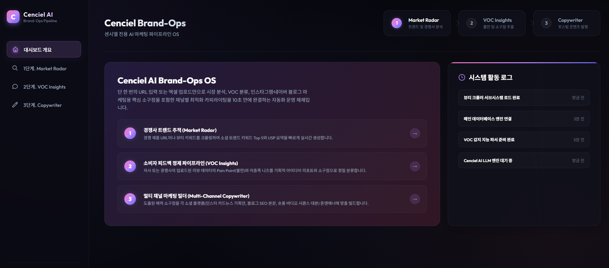
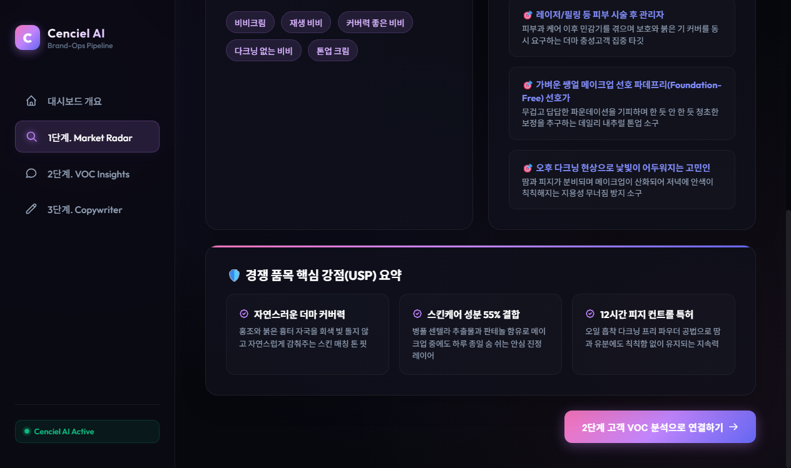
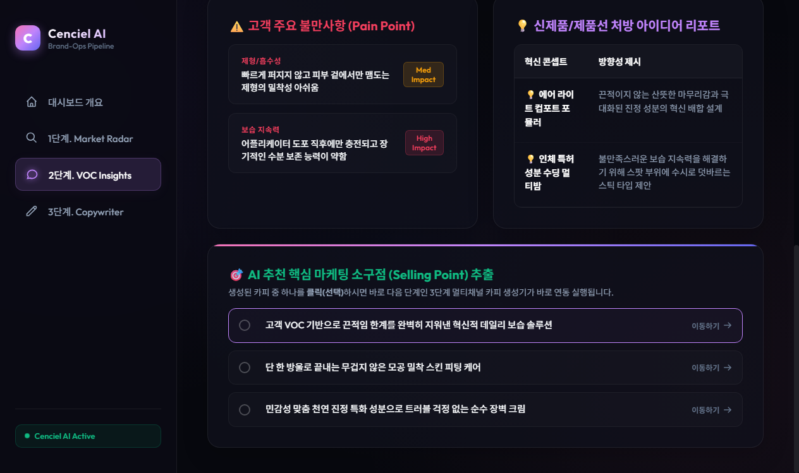
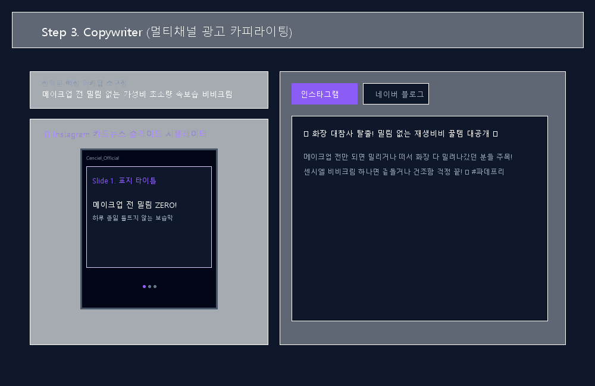

# 📖 Cenciel AI Brand-Ops 페이지별 상세 설명 가이드

이 문서는 **Cenciel AI Brand-Ops OS**의 핵심 화면(페이지) 구성과 각 단계별 기능, 데이터의 처리 흐름을 상세하게 안내합니다. 

본 MVP는 마케팅 자동화 파이프라인의 **3단계 워크플로우**가 한 페이지 내에서 유기적으로 연동되며 작동하도록 직관적으로 설계되었습니다.

---

## 🧭 대시보드 허브 구조 개요

웹 브라우저를 통해 `http://127.0.0.1:8000`에 접속하면, 화면 전체를 관통하는 어두운 계열의 **Glassmorphic 대시보드**가 열립니다.

### 🖼️ 대시보드 메인 레이아웃 (Overview)

> **💡 이미지 추가 가이드**: 로컬 서버(`uvicorn main:app`)를 켜고 첫 페이지를 캡처하여 `static/images/01_overview.png`로 저장하면, 깃허브 업로드 시 위 자리에 실제 캡처 이미지가 자동으로 나타납니다.

```html
<!-- 파이프라인 진행 상태를 도식화한 HTML 시각화 구조안 -->
<div style="background: rgba(30, 41, 59, 0.7); border: 1px solid rgba(255, 255, 255, 0.08); border-radius: 12px; padding: 20px; font-family:-apple-system, BlinkMacSystemFont, sans-serif;">
  <h3 style="color: #fff; margin-bottom: 15px; font-size: 16px;"> Cenciel AI Brand-Ops Pipeline</h3>
  <div style="display: flex; justify-content: space-between; align-items: center; flex-wrap: wrap; gap: 10px;">
    <!-- Step 1 -->
    <div style="background: rgba(139, 92, 246, 0.15); border: 1px solid #8b5cf6; padding: 12px; border-radius: 8px; flex: 1; min-width: 150px; text-align: center;">
      <span style="font-size: 11px; color: #a78bfa; font-weight: 700;">1단계. 시장 분석</span>
      <h4 style="color: #fff; margin: 5px 0 2px 0; font-size: 14px;">Market Radar</h4>
    </div>
    <div style="color: #64748b; font-weight: bold; font-size: 20px;">➔</div>
    <!-- Step 2 -->
    <div style="background: rgba(255, 255, 255, 0.02); border: 1px solid rgba(255, 255, 255, 0.08); padding: 12px; border-radius: 8px; flex: 1; min-width: 150px; text-align: center;">
      <span style="font-size: 11px; color: #94a3b8; font-weight: 700;">2단계. 피드백 요약</span>
      <h4 style="color: #fff; margin: 5px 0 2px 0; font-size: 14px;">VOC Insights</h4>
    </div>
    <div style="color: #64748b; font-weight: bold; font-size: 20px;">➔</div>
    <!-- Step 3 -->
    <div style="background: rgba(255, 255, 255, 0.02); border: 1px solid rgba(255, 255, 255, 0.08); padding: 12px; border-radius: 8px; flex: 1; min-width: 150px; text-align: center;">
      <span style="font-size: 11px; color: #94a3b8; font-weight: 700;">3단계. 멀티 카피</span>
      <h4 style="color: #fff; margin: 5px 0 2px 0; font-size: 14px;">Copywriter</h4>
    </div>
  </div>
</div>
```

* **헤더 바**: Cenciel AI 로고와 모니터링 표시 배지(`Cenciel AI Active` 무부하 녹색등)가 상시 작동합니다.
* **통합 레이아웃**: 상단에 3단계 파이프라인의 진행 과정을 시각적으로 안내하고, 세부 섹션 이동이 자유로운 **탭 컨트롤** 방식을 제공합니다.

---

## 📊 페이지 및 단계별 상세 해설

### 1단계. 시장 경쟁 레이더 (Market Radar)
브랜드 매니저가 분석할 화장품 키워드 또는 쇼핑몰 경쟁 제품의 상세 URL을 긁어오는 첫 기여 단계입니다.

### 🖼️ 1단계 구동 화면 (Market Radar)

> **💡 이미지 추가 가이드**: 입력란에 "비비크림"을 기입하고 분석이 끝난 마켓 레이더 대시보드를 캡처해 `static/images/02_market_radar.png`로 저장하세요.

```html
<!-- 1단계 입력 화면 예시 -->
<div style="background: #020617; border: 1px solid rgba(255,255,255,0.06); border-radius: 8px; padding: 15px; margin: 10px 0;">
  <span style="color:#a78bfa; font-size: 11px; font-weight: bold;">🔎 INPUT FIELD</span>
  <div style="padding: 10px; background: rgba(255,255,255,0.03); border: 1px dashed rgba(255,255,255,0.1); border-radius: 6px; margin: 8px 0; color:#fff; font-size: 13px;">
    비비크림
  </div>
  <button style="width: 100%; padding: 8px; background: #8b5cf6; border: none; border-radius: 4px; color: #fff; font-weight: bold; font-size: 12px; cursor: pointer;">
    시장 레이더 가동하기
  </button>
</div>
```

* **동작 프로세스**:
  1. 기획하고자 하는 키워드(예: `비비크림`)를 텍스트 창에 입력합니다.
  2. `시장 레이더 가동하기` 버튼을 클릭하면 백엔드로 `POST /api/analyze-market` 요청이 비동기 송신됩니다.
  3. **크롤러(`crawler.py`)**가 키워드 및 해당 사이트의 메타 정보를 수집 가공합니다.
  4. OpenAI 모델이 수집된 로우 텍스트에서 **인기 키워드 Top 5**, **경쟁사 주요 강점(USP) 3가지**, 그리고 신상품이 밀고 가야 할 **차별화 타겟팅 방향성**에 대한 인사이트를 도출합니다.

* **UI 구현 항목**: 
  - 시장 트렌드 키워드 리스트를 둥근 태그 디자인으로 배치
  - 타겟팅 방향성과 공략 방법을 깔끔한 테이블 카드로 시너지 제공

---

### 🧪 2단계. 소비자 VOC 인사이트 분류 (VOC Insights)
실제 사용 고객들의 적나라한 리뷰 텍스트나 별점을 정량/정성적으로 시각화하고 해결방안을 요약하는 파트입니다.

### 🖼️ 2단계 구동 화면 (VOC Insights)

> **💡 이미지 추가 가이드**: 리뷰 파일을 드래그해서 통계 차트와 카테고리 태그들이 생성된 화면을 캡처한 뒤 `static/images/03_voc_insights.png`로 저장하세요.

```html
<!-- 2단계 VOC 결과물 렌더링 목업 -->
<div style="background: #020617; border: 1px solid rgba(255,255,255,0.06); border-radius: 8px; padding: 15px; margin: 10px 0; display: grid; grid-template-columns: 1fr 1fr; gap: 15px;">
  <!-- 좌측: Pain Point 분석 -->
  <div style="background: rgba(255,255,255,0.02); padding: 10px; border-radius: 6px;">
    <span style="color:#ef4444; font-size: 11px; font-weight: bold;">⚠️ 고객 Pain Point</span>
    <div style="background: rgba(244,63,94,0.1); border: 1px solid rgba(244,63,94,0.2); padding: 6px; border-radius: 4px; color:#f43f5e; font-size: 11px; margin-top: 5px;">
      제형: 화장 전 밀림 현상 발생 (High)
    </div>
  </div>
  
  <!-- 우측: 별점 가중 통계 -->
  <div style="background: rgba(255,255,255,0.02); padding: 10px; border-radius: 6px;">
    <span style="color:#94a3b8; font-size: 11px; font-weight: bold;">📊 평점 분포</span>
    <div style="font-size: 11px; color:#fff; margin-top: 5px;">
      5 ★ <progress value="85" max="100" style="width: 70px; height: 8px;"></progress> 85%<br>
      4 ★ <progress value="30" max="100" style="width: 70px; height: 8px;"></progress> 30%
    </div>
  </div>
</div>
```

* **동작 프로세스**:
  1. 두 가지 입력 방식 중 택일할 수 있습니다:
     - **엑셀/CSV 업로드**: 사용 중인 타사 사이트나 쇼핑몰에서 다운로드받은 리뷰 파일을 드래그합니다. 내부 **`VOCAnalyzer`**가 데이터 프레임 컬럼을 오토 디텍션 및 파싱합니다.
     - **텍스트 붙여넣기**: 소셜 버즈 내용들을 한 줄마다 한 개 의견으로 구분해 텍스트창에 빠르게 붙여 넣으며 실행합니다.
  2. 전송 이후 백엔드에서 텍스트의 불만 주제를 핵심 가닥으로 묶은 **Pain Point 라벨**, 불편함을 장점으로 기회 승화하기 위한 **신제품 컨셉 리포트**, 그리고 홍보에 특화된 **1줄 핵심 소구점(Selling Point)**을 만들어냅니다.

* **UI 구현 항목**:
  - 추천 소구점 카드 리스트: 마음에 드는 핵심 소구점을 마우스로 **클릭**하면 자동으로 3단계 카피라이팅 텍스트 인풋 박스로 내용이 실시간 복사되며 3단계 화면으로 전환됩니다.

---

### ✍️ 3단계. 멀티 채널 콘텐츠 제너레이터 (Copywriter)
선택한 1줄 핵심 소구점을 원료로 활용해 당장 채널에 배포 가능한 수준의 마케팅 광고 원고를 구성해내는 제작 최종 단계입니다.

### 🖼️ 3단계 구동 화면 (Copywriter)

> **💡 이미지 추가 가이드**: 생성된 SNS 카드뉴스 포맷과 우측 본고 텍스트 에디팅 화면을 캡처한 뒤 `static/images/04_copywriter.png`로 저장하세요.

```html
<!-- 3단계 결과 브라우저 및 카드뉴스 목업 -->
<div style="background: #020617; border: 1px solid rgba(255,255,255,0.06); border-radius: 8px; padding: 15px; margin: 10px 0;">
  <div style="display: flex; gap: 15px; align-items: flex-start;">
    <!-- 스마트폰 형태 기기 화면 -->
    <div style="width: 90px; border: 2px solid #475569; border-radius: 12px; padding: 4px; background: #0f172a; text-align: center;">
      <span style="font-size: 8px; color: #fff;">Preview</span>
      <div style="height: 100px; background:#020617; border-radius: 8px; padding: 5px; font-size: 9px; color:#fff; display: flex; flex-direction: column; justify-content: center;">
        <strong style="color:#8b5cf6;">Slide 1</strong>
        화장 전 밀림 제로!
      </div>
    </div>
    
    <!-- 세부 원고 채널 -->
    <div style="flex: 1;">
      <span style="color:#10b981; font-size: 11px; font-weight: bold;">📱 인스타그램 / 블로그 / 숏폼 탭 구성</span>
      <div style="font-size: 11px; color:#cbd5e1; margin-top: 5px; background:rgba(255,255,255,0.02); padding: 8px; border-radius: 4px;">
        원하는 생성 채널을 자유롭게 탭하여 복사하기 전 상세 원고를 가독성 있게 편집 및 모니터링할 수 있습니다.
      </div>
    </div>
  </div>
</div>
```

* **동작 프로세스**:
  1. 2단계 연계를 통해 자동으로 삽입된 소구점 텍스트를 기점으로 `콘텐츠 생성하기` 버튼을 구동합니다.
  2. 백엔드 `POST /api/generate-content` 호출이 완료되면 멀티탭 레이아웃이 화면에 동시 전개됩니다.
  3. **세부 채널별 원고 제공 사양**:
     - **인스타그램 (Instagram)**: 카드뉴스 장표 단위 구성 텍스트 및 레이아웃 가이드라인, 게시물 본문에 즉시 사용될 해시태그와 친근한 감성 이모지 본문을 전달합니다.
     - **네이버 블로그 (Naver Blog)**: 포스팅 제목, 설득력을 유발하는 도입부 문맥, 파트별 상세 본문 및 구매를 최종 독려하는 맺음말로 구성된 풀스토리 기획본을 서빙합니다.
     - **숏폼 (Reels / Shorts)**: 15초 내외 비디오 무빙 타이밍 구성과 내레이션 대사 대본을 Scene 단위의 대조 표로 출력하여 영상 제작 과정을 단순화합니다.

* **UI 구현 항목**:
  - 카드뉴스 레이아웃에 반응해 모바일 스크린의 도트 인디케이터가 생성 장표 개수에 따라 자동 가변(Variable UI Dot Count)하여 동작
  - 플랫폼별 생성 복사 버튼을 눌러 손쉽게 원고를 전체 클립보드에 바인딩

